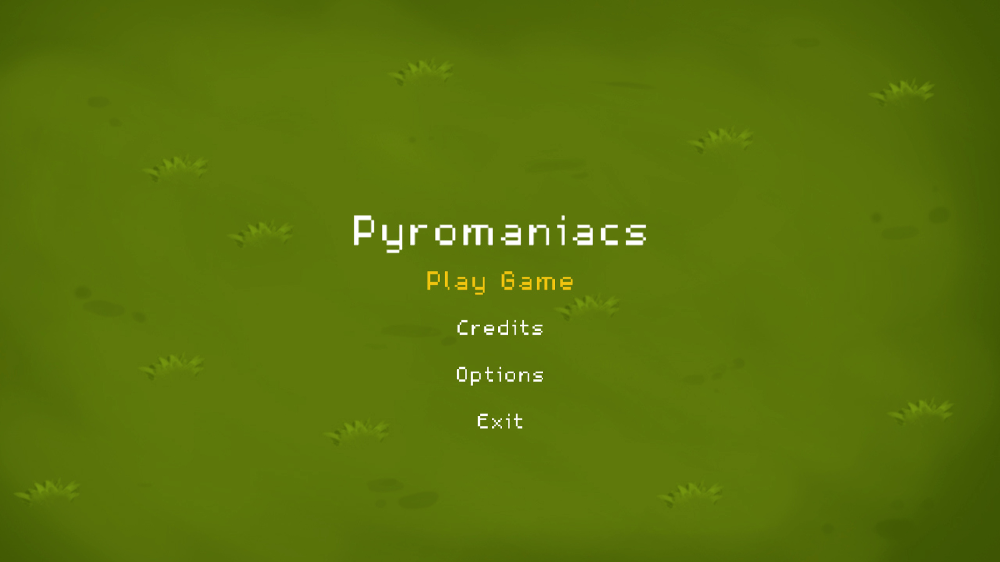

# Pyromaniacs

Pyromaniacs is a two-man project, that was done for a school project back in 2017.
It's a simple 2D Bomberman clone that could be played up to four players.

##Powerups

Powerups are hidden inside the rocks. So you have to destroy these rocks to find a power up.
- Speed: Your movement speed get increased by a small value
- +1 Bomb: Place one more bomb when you pick up this Power Up
- Shield: For a few seconds you have a shield that protects you from bombs and fire.
- +1 Radius: Increases the spread radius of the fire

## Controls

| Player | Device          | Movement    | Place bomb |
|--------|-----------------|-------------|------------|
| #1     | Keyboard        | A S D W     | Ctrl       |
| #2     | Keyboard        | Arrow Keys  | Space      |
| #3     | XBox Controller | Thumbsticks | A          |
| #4     | XBox Controller | Thumbsticks | A          |

## Credits

Pixel Explosion (12 Frames)
http://opengameart.org/content/pixel-explosion-12-frames

"Blip Stream" Kevin MacLeod (incompetech.com)
Licensed under Creative Commons: By Attribution 3.0 License
http://creativecommons.org/licenses/by/3.0/